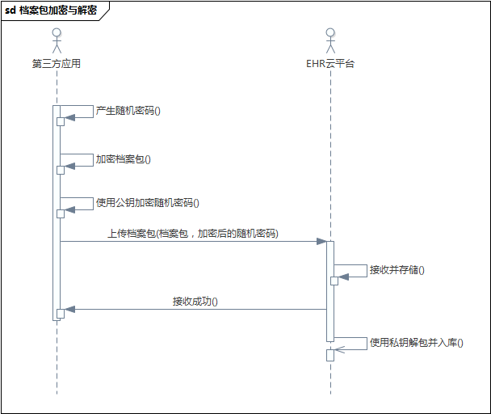

档案上传
====================

- 作者：温富建，2016.02.18

概述
---------------------

此文档描述健康档案网关接收档案的业务逻辑，包括标准档案，非结构化档案及轻量级档案，各种档案接收后的处理有所不同，在传递档案的时候请根据具体的档案类型提供相应的档案包。
客户端需要根据业务场景，构建相应的JSON包再提交给健康档案平台。

**注意：档案接收地址为[https://da.yihu.com/api](https://da.yihu.com/api)。**

流程
---------------------

应用根据健康档案数据标准采集数据后，将数据转换为JSON格式（以数据集或摘要信息为单位），并且使用随机密码将JSON文件打包成ZIP文件，
再用机构公钥对随机密码加密，最后再调用服务端上传档案。服务端在接收到档案包后会使用相应的私钥解密档案包密码，再用此密码打开档案包提取数据。
如下图所示：

档案包类型与结构
---------------------

###标准档案

标准档案是指使用平台的数据标准采集并打包的健康档案，含有原始数据与标准数据两种格式，其特点是数据是结构化的，可直接用于后期的数据处理。

**ZIP包结构**

	根目录：
	|---origin/原始数据列表，JSON格式
	|---standard/标准数据列表，JSON格式
	|---index/patient_index.json，就诊事件摘要信息
	
其中，origin与standard目录分别包含原始数据与标准数据，两个目录下分别含有GUID命名的JSON文档，即数据集文件。index目录参见“轻量级档案”说明。

**数据集文件结构**

	{
      "inner_version": "数据标准ID",
      "patient_id": "必选。患者在信息化系统中的ID",
	  "event_no": "可选。患者在信息化系统中的事件号",
	  "org_code": "必选。组织机构代码，可在全国组织机构数据中查询",
	  "event_time": "必选。事件时间，格式：2015-10-05 00:00:00"
	  "create_date": "必选。档案包创建时间，格式：2015-11-05 17:30:56",
      "code": "数据集标识",
      "data": [
        {
          "数据元内部标识1": "值1",
          "数据元内部标识2": "值2",
          "数据元内部标识N": "值N"
        }
      ]     
    }
    
其中，data 表示此数据集所有的数据，是一个JSON数组。例如，医嘱数据集包含有所有的住院医嘱记录

**示例**

ZIP包：

	根目录：
    	|---origin
    		|------3c435ce1-4c28-4a0d-a83c-2207070dde48.json
    		|------4f330cef-2cac-4b1e-9e67-7f065f150c92.json
    	|---standard
    		|------934fdbb4-24d5-4a14-8d75-d0a0260d747a.json
    		|------f900085a-e0db-47ff-961f-46b20a380687.json
    	
数据集：

	{
	  "inner_version": "000000000000",
	  "patient_id": "10295514",
	  "event_no": "000622508",
	  "org_code": "41872607-9",
	  "event_time": "2015-10-05 00:00:00"
	  "create_date": "2015-11-05 17:30:56",
	  "code": "HDSD02_03",
	  "data": [
		{
		  "JDSD02_03_13": "血红蛋白",
		  "JDSD02_03_04": "2.9",
		  "HDSD00_01_547": "0.01mol/L",
		  "JDSD02_03_06": "1.1",
		  "JDSD02_03_07": "9.8"
		},
		{
		  "JDSD02_03_13": "血糖",
		  "JDSD02_03_04": "8.6",
		  "HDSD00_01_547": "0.01mol/L",
		  "JDSD02_03_06": "5.0",
		  "JDSD02_03_07": "12.9"
		},
		{
		  "JDSD02_03_13": "血钾",
		  "JDSD02_03_04": "8",
		  "HDSD00_01_547": "umg/L",
		  "JDSD02_03_06": "7.0",
		  "JDSD02_03_07": "19.8"
		}
	  ]
	}
        
###非结构化档案

非结构化档案是指在无法按健康档案标准采集数据的情况下，只提供文档原件（如PDF，Word）及部分摘要数据的情况。在文档调阅时也以原件的形式浏览。

**ZIP包结构**

	根目录：
    	|---documents/文件列表
    	|---meta.json
	
其中documents目录包含本次档案所有的非结构化原始文件，根目录下的meta.json文件包含此患者的部分摘要信息，其结构如下：
	
	{
		"patient_id":"病人ID",
		"event_no":"事件号",
		"inner_version":"采集版本号",
		"org_code":"机构编码",
		"create_date":"创建时间",
		"event_time":"事件时间",
		
		"data":
		[
			{
				"cda_doc_id": "CDA文档ID",
				"url": "档案请求路径，使用相对路径，主机使用机构中的配置参数",
                "expiry_date": "过期时间，格式：2015-11-05 17:30:56"
				"key_words": {
					//key格式: 数据集.数据元
					"key": "word"    
				},
				"content":
				[
					{
						"mime_type": "文件类型，参见:https://en.wikipedia.org/wiki/MIME",
						"name": "文件名1.扩展名;文件名2.扩展名"
					},
					{
						"mime_type": "文件类型，参见:https://en.wikipedia.org/wiki/MIME",
						"name": "文件名.扩展名"
					}
				]
			}
		]
    }
    
**示例**

ZIP包：

	根目录：
	|---documents
		|------住院病历1.png
		|------住院病历2.png
		|------检查报告1.pdf
		|------检查报告2.pdf
		|------检查报告3.pdf
	|---meta.json
	
meta.json

	{
		"inner_version": "000000000000",
		"patient_id": "10295514",
		"event_no": "000622508",
		"org_code": "41872607-9",
		"event_time": "2015-10-05 00:00:00"
		"create_date": "2015-11-05 17:30:56",
		
		data：
		[
			{
				"cda_doc_id": "CDA_ABC",
				"url": "/api/patient/patient_id=10295514&event_no=000622508",
				"expiry_date": "2016-10-10 00:00:00"
				"key_words": {
					"key1": "word1",
					"key2": "word2",
					"key3": "word3"
				},
				"content":{
					"mime_type": "application/msword",
					"name": "住院病历.doc"
				}
			}，
			{
				"cda_doc_id: "CDA_DEF",
				"url": "/api/patient/patient_id=10295514&event_no=000622508",
				"expiry_date": "2016-10-10 00:00:00"
				"key_words": {
                  					"dataset.code": "value" 
                },
				"content":[
					{
						"mime_type": "application/png",
						"name": "检验报告-血常规.png;检验报告-尿常规.png"
					},
					{
						"mime_type": "application/pdf",
						"name": "检验报告-肝功能.pdf;检验报告-肾功能.pdf"
					}
				]
			}
		]
    }

###轻量级档案

轻量级档案是指部分机构自己管理患者的健康档案，但通过健康档案平台向第三方请求患者数据，即机构存储患者的数据而平台只存储患者的数据索引。
此模式下，平台仅可以访问患者的数据，而不能对其进行二次处理。

**ZIP包结构**

	根目录：
	|---index/patient_index.json
	
其中index目录保存病人的档案数据，档案包仅有此目录。此目录下的patient_index.json文件包含患者档案在机构的访问路径和部分平台所需要的摘要数据，其结构如下：

	{
		"patient_id": "病人ID",
		"event_no": "事件号",
		"org_code": "机构代码",
		"inner_version": "标准版本",
		"visit_type": "就诊类型 （门诊或住院）",
		"event_time": "事件时间，格式：2014-02-27 15:05:06",
		"expiry_date": "档案过期时间，格式：2014-02-27 15:05:06",
		
		// 档案所包含数据集
		dataset:
		{
			"数据集1标识": "url1",
			"数据集2标识": "url2"
		}，
		
		// 就诊摘要信息，此部分数据可扩展。
		summary:
		[
			{
				"数据集标识":
				[
					{
						"数据元1标识": "值"
						"数据元2标识": "值"
					},
					{
						"数据元1标识": "值"
						"数据元2标识": "值"
					}
				]
			}
		]
	}

档案存储模式
---------------------

鉴于部分医疗机构会自己存储档案，平台对档案的存储管理模式分为两种：集中式与分布式。用户通过健康档案浏览器访问时是透明的，不受影响。

集中式档案由平台负责管理，用户通过健康档案浏览器访问时不需要再通过医疗机构即可直接访问到所需要的数据，速度快。

分布式档案由医疗机构管理，用户通过健康档案浏览器访问时需要通过医疗机构对外开放的接口访问，速度相对较慢。

API列表
---------------------

以下为当前开放的档案接收接口，后续将会开放更多的接口。

### 档案包接收

接收第三方应用传送过来的患者健康档案。档案类型包含普通档案包，非结构化档案包与轻量级档案包，请参见相应档案包说明，按其结构封装数据。

	POST /packages
	
**参数**

<table>
	<tr>
		<td>名称</td>
		<td>类型</td>
		<td>描述</td>
	</tr>
	<tr>
		<td>package</td>
		<td>MultipartHttpServletRequest</td>
		<td></td>
	</tr>
	<tr>
		<td>user_name</td>
		<td>string</td>
		<td>用户ID</td>
	</tr>
	<tr>
		<td>package_crypto</td>
		<td>string</td>
		<td>档案包密码，使用公钥加密</td>
	</tr>
	<tr>
		<td>md5</td>
		<td>string</td>
		<td>档案包MD5</td>
	</tr>
</table>
