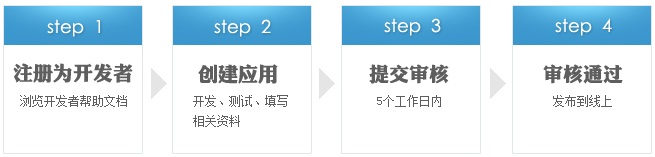

健康档案开放平台
====================

> 作者：温富建，2016.02.18

欢迎来到健康档案开放平台开发者中心。

健康档案(EHR)开放平台的特点
---------------------

**开放性：**

平台是健康之路公司查询个人健康档案的入口，面向所有网民敞开，用户可以通过健康档案浏览器和使用第三方应用查看自己的健康档案。

**对接海量需求：**

每天响应数巨大的数据搜索与浏览请求，让应用提供商与海量需求实现有效对接。

**优质资源：**

通过健康档案(EHR)开放平台，更多优质的第三方应用和内容资源，将可以直接与用户需求无缝对接。

**跨领域，多元化：**

现阶段健康档案(EHR)开放平台上的应用，直接在浏览器中运行，有涵盖pc、无线平台的应用。未来将连接更多线上线下业务与应用。 

平台以患者身份证号为核心，以数据标准为框架，构建整个平台的业务基础。平台中的患者均以身份证号为索引，贯穿患者所有的健康数据。
数据标准是患者健康档案的框架，作为档案的收集、分析及资源化基础。平台数据标准以卫计委发布的居民健康档案数据标准为蓝本，并简化其模型。

健康档案(EHR)开放平台的出现背景
---------------------

随着医疗行业的逐步开发，患者与医疗机构对健康档案的系统化管理提出了更高的要求，即除了常规的医疗机构自己的数据管理外，用户还对自身的日常健康数据管理提出要求。
但是碎片化的数据始终无法达到用户期望的数据管理，即“终生健康档案”管理。另一方面为减少过度医疗，需要有更方便的健康档案查询与互认操作，医疗工作者健康档案的质量认可也在达到一个新的高度。

来自用户各方面的需求目前正在迅速扩张，由此我们推出了健康档案(EHR)开放平台。

健康档案(EHR)开放平台对用户的价值
---------------------

对于普通用户而言，健康档案(EHR)开放平台意味着随时随地的个人健康档案管家。用户的终身健康数据均可以接入健康档案(EHR)开放平台，提高用户对自身健康的关注程度。

在基于云计算的框架下，用户可以调用线上线下多种资源为自己服务，例如保险，药店，旅游，儿童免疫，最终返回用户所需要的结果。

如何加入健康档案(EHR)开放平台
---------------------

健康档案(EHR)开放平台是一个面向所有合作伙伴（包括个人开发者）完全开放的平台。任何通过审核的优质应用，都可以与用户需求直接对接。
注册需要到健康档案(EHR)开放平台首页，首先注册为开发者并登录，然后点击右上方”提交应用“的按钮，按照提示信息注册应用，即可开始提交应用。

具体流程示意如下： 

应用UI设计与审核规范
---------------------
