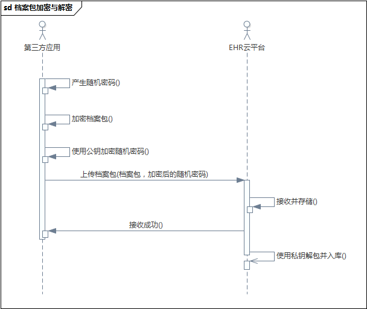

档案接收
====================

- 作者：温富建，2016.02.18

1 说明
---------------------

此文档描述健康档案网关接收档案的业务逻辑，包括标准档案，非结构化档案及轻量级档案，各种档案接收后的处理有所不同，在传递档案的时候请根据具体的档案类型提供相应的档案包。
客户端需要根据业务场景，构建相应的JSON包再提交给健康档案平台。

API规范参见：[API规范](../../specification/index.html)

2 档案包类型与结构
---------------------

档案包以zip文件的形式提供，并且使用随机密码加密，密码本身使用机构的公钥加密。服务端在接收到档案包后会使用相应的私钥解密档案包密码，再用此密码打开档案包提取数据。
其流程如下：

##标准档案

标准档案是指使用平台的数据标准采集并打包的健康档案，含有原始数据与标准数据两种格式，其特点是数据是结构化的，可直接用于后期的数据处理。

标准档案的结构如下：

	zip 包：
	|---origin
	|------3c435ce1-4c28-4a0d-a83c-2207070dde48.json
	|------4f330cef-2cac-4b1e-9e67-7f065f150c92.json
	|---standard
	|------934fdbb4-24d5-4a14-8d75-d0a0260d747a.json
	|------f900085a-e0db-47ff-961f-46b20a380687.json
	
其中origin与standard目录分别包含原始数据与标准数据，两个目录下分别含有GUID命名的JSON文档，即数据集，其格式如下：

	{
      "inner_version": "000000000000",
      "patient_id": "10295514",
	  "event_no": "000622508",
	  "org_code": "41872607-9",
	  "event_time": "2015-10-05 00:00:00"
	  "create_date": "2015-11-05 17:30:56",
      "code": "HDSC02_01",
      "data": [
        {
          "HDSD00_02_052": "YB11",
          "HDSD00_01_002": "朱蕊",
          "HDSD00_01_003": "女",
          "HDSD00_01_012": "汉族",
          "HDSB05_02_001": "000622508",
          "HDSD00_01_010": null,
          "HDSD00_01_008": "0",
          "HDSD00_01_009": null,
          "HDSB05_02_009": "未婚",
          "HDSD00_12_166": "1",
          "HDSD00_01_007": "郸城县特种合金厂<411625000319>",
          "HDSD00_01_579": "000622508",
          "HDSD00_01_004": "1940-07-19 00:00:00.0",
          "HDSD00_01_016": "其他"
        }
      ]     
    }
    
其中：

- inner_version表示此档案所使用的数据标准版本
- patient_id与event_no表示患者在特定医疗管理系统中的标识（某些医疗管理系统可能没有实现event_no，只提供patient_id）
- org_code表示此档案的来源机构代码
- event_time表示此医疗事件的发生时间，根据不同事件，其含义可能不同，如：门诊挂号时间，住院的入院时间
- create_date表示此档案包的创建时间
- code 表示此数据集标识
- data 表示此数据集所有的数据，是一个JSON数组。例如，医嘱数据集包含有所有的住院医嘱记录

##非结构化档案

非结构化档案是指在无法按健康档案标准采集数据的情况下，只提供文档原件（如PDF，Word）及部分摘要数据的情况。在文档调阅时也以原件的形式浏览。

非结构化档案的结构如下：

	zip 包：
	|---documents
	|------fiel1.png
	|------file2.doc
	|------file3.pdf
	|---standard
	|------summary.json
	
其中documents目录包含本次档案所有的非结构化原始文件，standard目录下的summary.json文件包含此患者的部分摘要信息，其结构如下：

	{
		"data": [],
		"code": "HDSC01_02",
		"patient_id": "11644159",
		"event_no": "1001271179",
		"org_code": "test001",
		"inner_version": null,
		"create_date": "2015-12-11 14:46:20",
		"event_time": "2015-09-30 10:08:01",
		"resource": {
			//档案请求路径
			"url": "/api/v1.0/archives/patient/HDSC01_02/11644159/1001271179",
			
			//过期时间
			"expiry_date": {
				"$date": 1450075583469					   
			}
		}
	}

##轻量级档案

轻量级档案是指部分机构自己管理患者的健康档案，但通过健康档案平台向第三方其患者数据，即机构存储患者的数据而平台只存储患者的数据索引。
此模式仅可以访问患者的数据，而不能对其进行二次处理。

轻量级档案的结构如下：

	zip 包：
	|---index
	|------patient_index.json
	
其中index目录保存病人的档案数据，档案包仅有此目录。patient_index.json文件为患者在机构的档案访问路径而部分摘要数据，其结构如下：

	{
		"patient_id": "11644159",
		"event_no": "1001271179",
		"org_code": "test001",
		"inner_version": 000000000000,
		
		//就诊类型 （门诊或住院）
		"visit_type": "outpatient",		
		"event_time": "2015-09-30 10:08:01",
		
		//档案请求路径
		"resource": {
			"url": "/api/v1.0/archives/patient/HDSC01_02/11644159/1001271179", 
			
			//过期时间
			"expiry_date": {
				"$date": 1450075583469					   
			}
		},
		summary:{
			//机构编码	
			"org_code": "test001",
					
			//事件号
			"HDSD03.HDSD03_01_031": "1001305971",		
				
			//就诊机构
			"HDSC01.HDSD00_01_560": null,
			
			//就诊科室代码"
			HDSD00.JDSC01_02_03" : "119",
			
			//就诊科室名称
			"HDSD00.HDSD00_01_561": "病区门诊",
			
			//事件时间
			"HDSD00.HDSD00_01_457": "2015-10-05 15:42:05",
			
			//诊断代码
			"HDSD00.HDSD00_01_550": " J18.101 ",
			
			//诊断名称
			"HDSD00.HDSD00_01_549": "大叶性肺炎"
		}
	}

3 档案存储模式
---------------------

鉴于部分医疗机构会自己存储档案，平台对档案的存储管理模式分为两种：集中式与分布式。用户通过健康档案浏览器访问时是透明的，不受响应。

集中式档案由平台负责管理，用户通过健康档案浏览器访问时不需要再通过医疗机构即可直接访问到所需要的数据，速度快。

分布式档案由医疗机构管理，用户通过健康档案浏览器访问时需要通过医疗机构对外开放的接口访问，速度相对较慢。

4 API列表
---------------------

以下为当前开放的档案接收接口，后续将会开放更多的接口。

### 档案包接收

接收第三方应用传送过来的患者健康档案。档案类型包含普通档案包，非结构化档案包与轻量级档案包。

	POST /json_package
	
**参数**

<table>
	<tr>
		<td>名称</td>
		<td>类型</td>
		<td>描述</td>
	</tr>
	<tr>
		<td>package</td>
		<td>MultipartHttpServletRequest</td>
		<td></td>
	</tr>
	<tr>
		<td>user_name</td>
		<td>string</td>
		<td>用户ID</td>
	</tr>
	<tr>
		<td>package_crypto</td>
		<td>string</td>
		<td>档案包密码，使用公钥加密</td>
	</tr>
	<tr>
		<td>md5</td>
		<td>string</td>
		<td>档案包MD5</td>
	</tr>
</table>

### 转诊数据包

接收转诊数据包，转诊数据包格式请按标准档案封装。

	curl /patient/referral/json_package
	
**参数**

<table>
	<tr>
		<td>名称</td>
		<td>类型</td>
		<td>描述</td>
	</tr>
	<tr>
		<td>package</td>
		<td>MultipartHttpServletRequest</td>
		<td></td>
	</tr>
	<tr>
		<td>user_name</td>
		<td>string</td>
		<td>用户ID</td>
	</tr>
	<tr>
		<td>package_crypto</td>
		<td>string</td>
		<td>档案包密码，使用公钥加密</td>
	</tr>
	<tr>
		<td>md5</td>
		<td>string</td>
		<td>档案包MD5</td>
	</tr>
</table>

