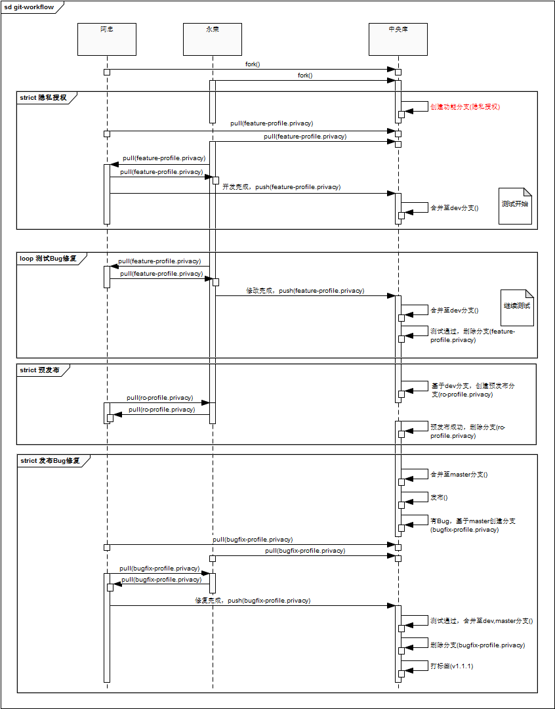

# Git工作流

- Sand Wen, 2016.07.13

## 背景：

鉴于最近的代码管理松散，给开发，测试及发布过程带来的储多问题，现重构git管理流程，在原来的基础上增加新的管理环节。
本次重构以“隐私授权”功能的开发为例，设置角色：阿忠与永荣，版本为1.1.0。在阅读前，首先说明下本次改造的前提：

- 中央库只维护master与dev分支。
- 除了中央库的两个分支，还有三种临时性分支：功能分支，候选发布分支及Bug修复分支。
- 临时分支创建原则"代码隔离"，即代码的修改应该不受其他非相关功能影响。分支创建命名约定：
    - 功能分支以"feature-"开头，以功能名称结束，如feature-profile.privacy。
    - 候选发布分支以"rc-"(release candidate)开头，以发布版本结束，如：rc-1.1.0。
    - Bug修复分支以"bugfix-"开头，以修复的发布版本结束，如：bugfix-1.1.0。
- 开发时以功能为导向。
- 标签只在master分支上。

## 流程

以下是示例工作流时序图：

### fork

所有的开发者都必须先fork一份中央库的源代码。

### 功能开发

**分支创建**

根据每月任务，由管理员创建分支。在开始隐私授权功能的开发之前，需要创建一个新的分支，根据命名约定，
我们命名为：feature-profile.privacy。功能分支的创建可以有不同情况：

- 在开发人员较少的时候，可以直接在某个开发者上创建这个分支，其他人员直接与这个用户互相pull/push，不需要管理员介入。
- 在开发人员较多的时候，开发者之前直接pull/push会变得非常麻烦，此时最好是在中央库上创建这个分支，开发者与中央库pull/push，管理员负责合并代码。

默认情况下，使用第二种情景，这会增加管理员的工作量，但如果代码审核不做，工作量并不会太多。本次，我们选择在主库上创建功能分支。

**开发**

分支创建成功之后，便可以开始开发工作，自行测试并提交，最后push到其他开发人员或主库的feature-profile.privacy上。

注意：若开发者需要同时开发两个功能，例如隐私授权与资源化，按原则需要建立不同的分支，开发时需要切换到对应的分支，完成之后再提交合并。

**合并至dev分支**

在功能主体开发完成后，管理员需要将这些代码合并到dev分支。

    git checkout dev
    git merger -no-ff feature-profile.privacy
    
### 测试Bug修复

经过测试人员的反馈，肯定有Bug存在(没有Bug当然更好)，此时开始测试Bug的修复。此过程与开发过程基本一致，开发人员开发，互相pull/push，
完成后推送到主库，管理员再合并到dev分支。

此时删除功能分支feature-profile.privacy。

### 预发布

**分支创建**

“没有一次发布是完美一步到位的”，因此我们需要一个预发布，检测在生产环境中会出现哪些问题。在预发布之前，需要在dev的分支上创建预发布分支，
预发布分支以rc-开头，并以发布的版本作为后缀，如：rc-1.1.0。

**修复**

预发布的过程中会暴露出问题，此时开发者着手修复这些问题，必要时开发者之间需要互相pull/push，在问题验证修复之后向主库推送，由管理员合并至rc-1.1.0分支。

### 发布

经过一轮的迭代，已经预发布成功了，此时便可以开始发布。管理员会将rc-1.1.0合并至master分支，并开始向生产环境中部署，并对外提供服务。

**分支创建**

在正式的服务过程中，依然会有Bug出现，但已经不需要非常大的修改，此时可以在master分支上创建bugfix分支，用于修复bug。

根据约定，管理员需要创建bugfix-1.1.0分支用于修复Bug。

**修复**

此时开发者从主库摘取bugfix-1.1.0分支，并开始处理，期间可能会与其他开发者互动,pull/push。待问题修复之后，推到主库，在测试通过之后，
管理员将此分支合并至dev与master两个分支，若有需要可以在master分支上打个标签，如：1.1.1。

至此，整个流程已经结束，按计划开始下一个流程。在整个流程结束后，观看git的分支图，您可能会看到像这样的情况：

## 可能遇到的问题

1 多功能同时开发

这个问题应该是第一个想到的，根据原则此时应该创建多个分支，在修改一个功能时需要切换到对应的分支处理。

2 基础类库的功能开发

这个问题其实与第1个问题是一致的，在编写基础模块时，需要创建一个新的分支，并在这个分支上编写代码，做单元测试。与第1个问题有点不同的是，
它暂时不需要通过测试人员组织大规模的测试，在单元测试及开发者测试过之后，可直接合并至dev分支(注意不是master分支)。
对有需要这些功能的，由管理员在主库合并之后，各开发者自行pull代码。